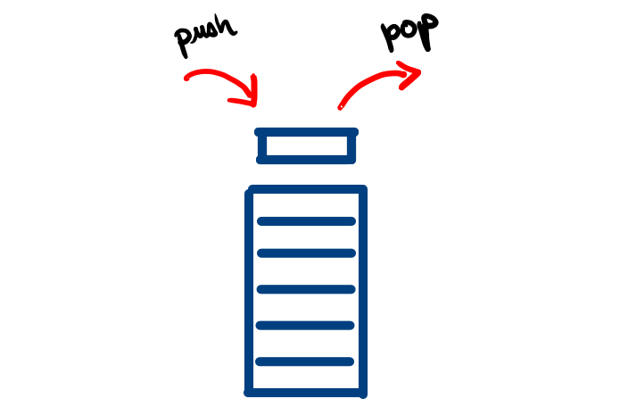

# Respuesta 1

## ¿Qué es un registro, pila, heap, puntero de instrucciones, puntero de pila?
+ **registro**. Es una unidad de la abstracción de la memoria física (RAM) sobre la que opera el 
computador al momento de ejecutar un proceso. Esta no es la memoria donde se guardan los datos 
del usuario(disco duro, SSD), puesto que esa memoria tiene otro tipo de abstracción. La memoria del
computador se administra en a través de los registros, que suelen tener una capacidad de almacenamiento 
del tamaño de un múltiplo de 8 bits(8, 16, 32, 64). A un conjunto de 8bits suele denominarsele byte, 
aunque un byte, en rigor, no siempre fue equivalente a 8bit de forma teórica. Los registron suelen 
almacenar información numérica relacionada al funcionamiento del programa, información de solo lectura 
relacionada al funcionamiento del computador, o incluso información de otros registros. Los registros 
suelen estar indexados con números hexadecimales.

+ **pila**. En el marco de un computador, es un conjunto de registros especial en la cual la forma de 
acceder a los registros que la componen es a través de dos operaciones: _push_ y _pop_. _push_ sirve 
para agregar un elemento a la pila y _pop_ sirve para recuperar el último elemento agregado. Es 
decir, solo se puede acceder al la información del último registro modificado. El tipo de información 
que almacene una pila depende de la arquitectura del computador y un computador podría tener muchas 
pilas.

Una implementación común en las arquitecturas modernas es la _pila de subrutinas_, esta pila 
almacena información de los registros en los cuales se almacenan subrutinas a donde el computador debe 
ir o debe regresar. Muchas veces, las pilas se usan también para almacenar argumentos que las subrutinas 
utilizan, de la misma forma en que en una programación de más alto nivel, se pasan argumentos a las 
funciones programadas. Ahora bien, la definición de la pila de un computador no debe confundirse con 
la abstracción de una pila que crea un sistema operativo para un proceso dado en un marco de memoria 
exclusivo para ese proceso. Es decir, el sistema operativo crea todo un espacio de memoria para cada 
proceso donde cada proceso tiene una pila donde almacenar las subrutinas que involucran su ejecución.
+ **heap**. El _montículo_, es la memoria asignada al proceso para que este asigne a variables dinámicas.
 Un proceso puede pedir ampliar su montículo haciendo llamadas al sistema. En el caso de C/C++, esto 
puede hacerse con la función `maloc` y su variantes.
+ **puntero de instrucciones**. Es un registro especial que tiene almacenada la dirección del registro 
del cual el procesador está leyendo al instrucción para ejecutar o la instrucción siguiente, en algunas 
arquitecturas. Este registro aumenta en uno a medida que se ejecuta una instrucción.
+ **puntero de pila**. Es un registro especial que almacena la dirección del registro en donde se 
encuentra el tope de la pila del programa. Este puntero decrementa a medida que se realizan operaciones 
_push_ sobre la pila.


## ¿Qué proporciona el tiempo compartido a la virtualización?
En realidad, utilizar la estrategia de _tiempo compartido_ es la forma en que se alcanza la 
virtualización. Se impide que los procesos ejecuten programas 'de corrido' para intercambiar entre 
procesos en momentos que sean 'oportunos', por ejemplo: al momento en el que los procesos no están 
utilizando el CPU porque se encuentran esperando la entrada de datos externos o un dato solicitado 
a otro poceso. Sin embargo, la implementación de este proceso también acarrea ciertas dificultades 
para el sistema operativo. Estas dificultades se detallarán luego, en las preguntas en las que se 
pregunte por ellas.

## ¿Deberı́a haber un lı́mite en la cantidad de procesos que un usuario puede ejecutar simultáneamente?
No, si es que existe un buen programador de procesos que haga un seguimiento a los procesos que 
corre cada usuario.

## ¿Por qué es una buena idea separar el mecanismo de las polı́ticas?


## Muestra el PCB de Linux
No estamos seguros de a qué se refiere con PCB.
Puede referirse a :
+ Lo que se encuentra en la ruta `/proc` que en mi caso particular es:
```
gwynplaine@tabernacle:~/Documentos/univir/soa/Practica-Calificada1-CC571$ ls  /proc/
1      1072   1171   1314   140   16    1779  1850  1934  255   3     34    4443  5272  6004  7131  869        cgroups      iomem        misc          swaps
10     1074   11792  13141  1415  1610  1797  1854  1939  256   30    35    4444  5276  6005  7167  870        cmdline      ioports      modules       sys
10381  1079   12     13179  1418  1616  1798  1864  1943  257   3017  36    448   5306  611   7246  872        consoles     irq          mounts        sysrq-trigger
1050   1081   1226   13185  142   1633  18    1865  1947  258   3018  37    4558  5316  6166  7526  873        cpuinfo      kallsyms     mtrr          sysvipc
1052   1089   12443  13218  143   1656  1800  1868  1958  259   3019  38    466   5390  617   7641  874        crypto       kcore        net           thread-self
1055   10906  12714  13283  144   1669  1801  1873  1959  260   3075  39    4726  5680  6188  7646  875        devices      keys         pagetypeinfo  timer_list
1057   1092   12748  1333   145   1670  1802  1876  1961  261   3083  396   4748  5719  6346  7649  881        diskstats    key-users    partitions    tty
1058   1093   12767  1335   15    1687  1803  1879  1968  267   3097  397   476   5748  6867  7660  8843       dma          kmsg         pressure      uptime
10625  1097   12768  1343   150   1690  1811  1893  2     268   3104  4     481   5776  6871  7661  9          driver       kpagecgroup  sched_debug   version
1064   1099   12783  135    151   17    1818  190   21    27    3107  40    482   5792  6884  7663  9101       execdomains  kpagecount   schedstat     version_signature
1066   11     12792  136    152   1709  1820  1903  22    273   3109  4089  4824  5855  6911  7669  9708       fb           kpageflags   scsi          vmallocinfo
10662  1128   12829  137    155   171   1830  1904  23    28    3212  41    483   5923  6920  7677  acpi       filesystems  loadavg      self          vmstat
1067   1129   12830  1373   156   1760  1837  1916  24    29    3281  42    4927  5930  6955  7705  asound     fs           locks        slabinfo      zoneinfo
1069   1155   12992  139    157   1772  1840  1923  252   2914  33    4245  508   5987  6972  7719  buddyinfo  i8k          mdstat       softirqs
10693  1170   13     14     159   1777  1847  1927  254   2991  3378  4259  5123  5995  7119  7746  bus        interrupts   meminfo      stat
```
Aquí se almacena la información de los procesos en ejecución.

+ O tal vez se refiera a la estructura de procesos presente en el kernel de linux. Esta se 
encuentra [aquí](https://elixir.bootlin.com/linux/latest/source/include/linux/sched.h#L632).

## ¿Cómo dificulta la ejecución directa que el OS cambie entre procesos?. ¿Cómo resuelve el OS este problema?
El cambio entre procesos implica lo siguiente:
+ El problema de seguridad. Cuando un proceso arbitrario que no tenga restricciones en sus operaciones 
respecto al hardware podría tener acceso a información a la que no debería. Los procesos corriendo en 
el **modo kernel**, tienen la capacidad de acceder ilimitadamente a los recursos del hardware. Los 
procesos corriendo en **modo usuario**, tienen que solicitar al sistema operativo que ejecute las 
instrucciones que requieren manejo de hardware por ellos.
+ El problema de la monopolización de la CPU. Cuando un proceso arbitrario ocupe tiempo de CPU y no 
genere una interrupción de hardware. Esto se soluciona agregando un tipo más de interrupción llamada 
**interrupción de reloj**. Esta interrupción consiste en generar una interrupción cada vez que el 
reloj del procesador cumpla un número determinado de ciclos. Al momento de haber una interrupción, 
ocurre un cambio de contexto.
+ La concurrencia. 

## ¿Qué hace el planificador (en términos simples)?
El planificador decide la forma en que la CPU se ocupará de los procesos. La CPU tiene que hacer 
una cantidad dinámica de procesos. El planificador se encarga de ver cómo se ejecutarán estos procesos 
de manera que  se consiga la máxima eficiencia.

## ¿Cómo mejora SJF sobre FIFO?
En FIFO, los procesos son ejecutados en el orden en el que llegan. Así, un proceso que tomaría poco 
tiempo de ejecución se ejecutaría antes que un programa que tomaría mucho tiempo de ejecución así 
el _trabajo grande_ hubiera llegado primero. Esto es importante porque el tiempo de respuesta para 
nuestro _trabajo pequeño_, será rápido.

## ¿Cómo mejora STCF sobre SJF?.
STCF mejora sobre SJF gracias a las interrupciones de reloj. Cada vez que hay una interrupción de reloj 
se cambia a otro proceso teniendo en cuenta una nueva métrica: el tiempo para que el proceso se complete. 
Así, si un proceso ya inició, el CPU tiene la capacidad de cambiar a un proceso que pueda terminar más 
rápido para poder tener un mejor tiempo de completado con ese proceso.

