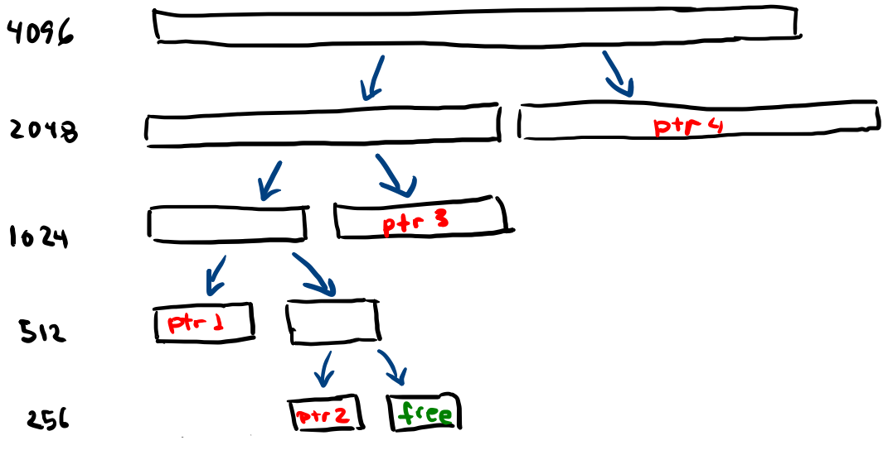
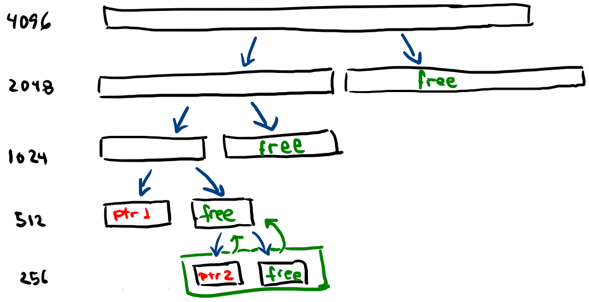

# Práctica calificada 2

Para esta práctica, asumiremos que nuestras direcciones son del tipo _big endian_.

## Pregunta 1
Considera un sistema que implementa la planificación de colas multinivel. ¿Qué estrategia
puede utilizar una computadora para maximizar la cantidad de tiempo de CPU asignado al
proceso del usuario? Qué pasa si el sistema implementa round-robin?.

El proceso deberá entregar voluntariamente(generar una interrupción... ¿cómo?, no lo sé) 
la CPU para mantenerse en la prioridad más alta y así correr en RR con los procesos de 
la cola de más alta prioridad, que es donde los procesos siempre inician. Si el sistema se 
implementa con roundrobin, es preciso aprovechar el CPU al máximo y no renunciar nunca 
a la CPU. No olvides ajustar el quantum.


## Pregunta 2
El tamaño de página en un sistema (que ejecuta un sistema operativo similar a Linux en
hardware x86) se incrementa manteniendo todo lo demás (incluido el tamaño total de la
memoria principal) igual. Para cada una de las siguientes métricas, indica si generalmente
se espera que la métrica aumente, disminuya o no cambie como resultado de este aumento
en el tamaño de la página:
+ Tamaño de la tabla de páginas de un proceso

  No variará. Pero hay que tener en cuenta que muchos marcos de página antes válidos 
  ya no serán más válidos debido a que el número de marcos de página se verá reducido.

+ Tasa de aciertos de TLB

  Teniendo en cuenta el _principio de localidad_, es intuitivo pensar que la tasa de aciertos de 
  TLB aumentará.

+ Fragmentación interna de la memoria principal

  La fragmentación interna podría aumentar debido a que, para los mismos programas, si hay 
  un mayor tamaño por página habrá más espacio que no se está usando del que ya había.


## Pregunta 3
Discute cómo los siguientes pares de criterios de planificación entran en conflicto en ciertos
entornos.

+ Uso de la CPU y tiempo de respuesta
    Un tiempo de respuesta óptimo no siempre implica un _buen uso de la CPU_.
    Piense, por ejemplo, en una lista de procesos que no ejecutan E/S que tienen una politica
    de Round Robin de **quantum corto**. El tiempo de respuesta será bueno, pero primará 
    el cambio de contexto. El _uso del CPU_ no será hecho por los procesos en sí.

+ Tiempo de entrega promedio y tiempo de espera máximo

    Si hay un tiempo de espera muy grande para un proceso dado, el tiempo de entrega 
    promedio aumentará.

+ utilización de dispositivos de E/S y utilización de la CPU.

    Siempre que se usa E/S, es porque se necesitan ingresar datos por parte del usuario para 
    resumir el uso de la CPU. Así, la CPU no se usa mientras la E/S se usa. Es mejor que la 
    CPU pase a otro proceso para reducir el tiempo de espera promedio.

## Pregunta 4

Considera un proceso con 4 páginas lógicas, numeradas del 0 al 3. La tabla de páginas del
proceso consta de las siguientes asignaciones de números de páginas lógicas a números de
trama fı́sica: ( 0, 11 ) , ( 1, 35 ) , ( 2, 3 ) , ( 3, 1 ) . El proceso se ejecuta en un sistema con direcciones
virtuales de 16 bits y un tamaño de página de 256 bytes. Se garantiza que este proceso
accede a la dirección virtual 770. Responde las siguientes preguntas, mostrando los cálculos
adecuados.

+ ¿A qué número de página lógica corresponde esta dirección virtual?

  Como el tamaño de página es de 256bytes, entonces necesitaremos 8 bits para referenciarla

```
+---+---+---+---+---+---+---+---+---+---+---+---+---+---+---+
|           pfn/vpn             |           offset          |
+---+---+---+---+---+---+---+---+---+---+---+---+---+---+---+
  0   1   2   3   4   5   6   7   8   9   10  11  13  14  15
```

  770 = 000000011 00000010. Luego, está referenciando la página virtual 3.


+  ¿A qué dirección fı́sica se traduce esta dirección virtual?

  Según el problema, la dirección 3 se mapea a 1. Entonces nuestra dirección traducida será 

  `000000001 00000010` lo que es equivalente a 8

## Pregunta 5

Proporciona una ventaja de usar el asignador slab en Linux para asignar objetos del kernel,
en lugar de simplemente asignarlos desde un heap de memoria dinámica.

Según [esto](https://www.kernel.org/doc/gorman/html/understand/understand011.html), permite eliminar la fragmentación causada por el algoritmo buddy. Además, proporciona 
una especia de caché para los susodichos objetos que el kernel usará.


## Pregunta 6

Considera un sistema simple que ejecuta un solo proceso. El tamaño de los marcos
fı́sicos y las páginas lógicas es de 16 bytes. La RAM puede contener 3 marcos fı́sicos.
Las direcciones virtuales del proceso tienen un tamaño de 6 bits. El programa genera
las siguientes 20 referencias de direcciones virtuales a medida que se ejecuta en la CPU:
0, 1, 20, 2, 20, 21, 32, 31, 0, 60, 0, 0, 16, 1, 17, 18, 32, 31, 0, 61. (Nota: las direcciones de 6 bits se
muestran en decimal aquı́.) Suponga que los marcos fı́sicos en la RAM están inicialmente
vacı́as y no se asignan a ninguna página lógica.

+ Traduzca las direcciones virtuales anteriores a números de página lógicos a los que hace
  referencia el proceso. Es decir, anote la cadena de referencia de 20 números de página
  correspondientes a los accesos de direcciones virtuales anteriores. Supongamos que las
  páginas están numeradas a partir de 0, 1, . . .

  Nuestra configuración sería:

```
+-------+-------+-------+-------+-------+-------+
|     pfn/vpn   |             offset            |
+-------+-------+-------+-------+-------+-------+
     0      1       2       3       4        5 
```

  Tenemos nuestras direcciones traducidas 00 0000, 00 0001, 01 0100, 00 0010, 01 0100, 
  01 0101, 10 0000, 01 1111, 00 0000, 11 1100, 00 0000, 00 0000, 01 0000, 000001, 01 0001, 
  01 0010, 10 0000, 01 1111, 000000, 11 1101

  Así, tomamos los dos primeros bits para encontrar el número de página. Tendremos, respectivamente, 
  00, 00, 01, 00, 01, 01, 10, 01, 00, 11, 00, 00, 01, 00, 01, 01, 10, 01, 00, 11. Lo que se traduce como 
  0, 0, 1, 0, 1, 1, 2, 1, 0, 3, 0, 0, 1, 0, 1, 1, 2, 1, 0, 3.


+ Calcula el número de fallas de página generadas por los accesos anteriores, suponiendo
  un algoritmo de reemplazo de página FIFO. También debes indicar correctamente qué
  accesos de página en la cadena de referencia que muestra en la parte (a) son respons-
  ables de las fallas de la página.

  Usaremos el programa `paging-politicas.py`.


```
  gwynplaine@tabernacle:~/ofuscateddirx$ python3 paging-politicas.py -p FIFO -a $access -c
  Argument addresses 0,0,1,0,1,1,2,1,0,3,0,0,1,0,1,1,2,1,0,3
  Argument addressfile 
  Argument numaddrs 10
  Argument policy FIFO
  Argument clockbits 2
  Argument cachesize 3
  Argument maxpage 10
  Argument seed 0
  Argument notrace False
  
  Resolviendo...
  
  Acceso: 0  MISS FirstIn ->          [0] <- Lastin  Reemplazado:- [Hits:0 Misses:1]
  Acceso: 0  HIT  FirstIn ->          [0] <- Lastin  Reemplazado:- [Hits:1 Misses:1]
  Acceso: 1  MISS FirstIn ->       [0, 1] <- Lastin  Reemplazado:- [Hits:1 Misses:2]
  Acceso: 0  HIT  FirstIn ->       [0, 1] <- Lastin  Reemplazado:- [Hits:2 Misses:2]
  Acceso: 1  HIT  FirstIn ->       [0, 1] <- Lastin  Reemplazado:- [Hits:3 Misses:2]
  Acceso: 1  HIT  FirstIn ->       [0, 1] <- Lastin  Reemplazado:- [Hits:4 Misses:2]
  Acceso: 2  MISS FirstIn ->    [0, 1, 2] <- Lastin  Reemplazado:- [Hits:4 Misses:3]
  Acceso: 1  HIT  FirstIn ->    [0, 1, 2] <- Lastin  Reemplazado:- [Hits:5 Misses:3]
  Acceso: 0  HIT  FirstIn ->    [0, 1, 2] <- Lastin  Reemplazado:- [Hits:6 Misses:3]
  Acceso: 3  MISS FirstIn ->    [1, 2, 3] <- Lastin  Reemplazado:0 [Hits:6 Misses:4]
  Acceso: 0  MISS FirstIn ->    [2, 3, 0] <- Lastin  Reemplazado:1 [Hits:6 Misses:5]
  Acceso: 0  HIT  FirstIn ->    [2, 3, 0] <- Lastin  Reemplazado:- [Hits:7 Misses:5]
  Acceso: 1  MISS FirstIn ->    [3, 0, 1] <- Lastin  Reemplazado:2 [Hits:7 Misses:6]
  Acceso: 0  HIT  FirstIn ->    [3, 0, 1] <- Lastin  Reemplazado:- [Hits:8 Misses:6]
  Acceso: 1  HIT  FirstIn ->    [3, 0, 1] <- Lastin  Reemplazado:- [Hits:9 Misses:6]
  Acceso: 1  HIT  FirstIn ->    [3, 0, 1] <- Lastin  Reemplazado:- [Hits:10 Misses:6]
  Acceso: 2  MISS FirstIn ->    [0, 1, 2] <- Lastin  Reemplazado:3 [Hits:10 Misses:7]
  Acceso: 1  HIT  FirstIn ->    [0, 1, 2] <- Lastin  Reemplazado:- [Hits:11 Misses:7]
  Acceso: 0  HIT  FirstIn ->    [0, 1, 2] <- Lastin  Reemplazado:- [Hits:12 Misses:7]
  Acceso: 3  MISS FirstIn ->    [1, 2, 3] <- Lastin  Reemplazado:0 [Hits:12 Misses:8]
  
  Estadisticas hits 12 misses 8  tasa_hit 60.00
  
```

+ Repite (b) para el algoritmo de reemplazo de página LRU.


```
  gwynplaine@tabernacle:~/ofuscateddirx$ python3 paging-politicas.py -p LRU -a $access -c
  Argument addresses 0,0,1,0,1,1,2,1,0,3,0,0,1,0,1,1,2,1,0,3
  Argument addressfile 
  Argument numaddrs 10
  Argument policy LRU
  Argument clockbits 2
  Argument cachesize 3
  Argument maxpage 10
  Argument seed 0
  Argument notrace False
  
  Resolviendo...
  
  Acceso: 0  MISS LRU ->          [0] <- MRU Reemplazado:- [Hits:0 Misses:1]
  Acceso: 0  HIT  LRU ->          [0] <- MRU Reemplazado:- [Hits:1 Misses:1]
  Acceso: 1  MISS LRU ->       [0, 1] <- MRU Reemplazado:- [Hits:1 Misses:2]
  Acceso: 0  HIT  LRU ->       [1, 0] <- MRU Reemplazado:- [Hits:2 Misses:2]
  Acceso: 1  HIT  LRU ->       [0, 1] <- MRU Reemplazado:- [Hits:3 Misses:2]
  Acceso: 1  HIT  LRU ->       [0, 1] <- MRU Reemplazado:- [Hits:4 Misses:2]
  Acceso: 2  MISS LRU ->    [0, 1, 2] <- MRU Reemplazado:- [Hits:4 Misses:3]
  Acceso: 1  HIT  LRU ->    [0, 2, 1] <- MRU Reemplazado:- [Hits:5 Misses:3]
  Acceso: 0  HIT  LRU ->    [2, 1, 0] <- MRU Reemplazado:- [Hits:6 Misses:3]
  Acceso: 3  MISS LRU ->    [1, 0, 3] <- MRU Reemplazado:2 [Hits:6 Misses:4]
  Acceso: 0  HIT  LRU ->    [1, 3, 0] <- MRU Reemplazado:- [Hits:7 Misses:4]
  Acceso: 0  HIT  LRU ->    [1, 3, 0] <- MRU Reemplazado:- [Hits:8 Misses:4]
  Acceso: 1  HIT  LRU ->    [3, 0, 1] <- MRU Reemplazado:- [Hits:9 Misses:4]
  Acceso: 0  HIT  LRU ->    [3, 1, 0] <- MRU Reemplazado:- [Hits:10 Misses:4]
  Acceso: 1  HIT  LRU ->    [3, 0, 1] <- MRU Reemplazado:- [Hits:11 Misses:4]
  Acceso: 1  HIT  LRU ->    [3, 0, 1] <- MRU Reemplazado:- [Hits:12 Misses:4]
  Acceso: 2  MISS LRU ->    [0, 1, 2] <- MRU Reemplazado:3 [Hits:12 Misses:5]
  Acceso: 1  HIT  LRU ->    [0, 2, 1] <- MRU Reemplazado:- [Hits:13 Misses:5]
  Acceso: 0  HIT  LRU ->    [2, 1, 0] <- MRU Reemplazado:- [Hits:14 Misses:5]
  Acceso: 3  MISS LRU ->    [1, 0, 3] <- MRU Reemplazado:2 [Hits:14 Misses:6]
  
  Estadisticas hits 14 misses 6  tasa_hit 70.00
```

+ ¿Cuál serı́a el menor número de fallas de página alcanzables en este ejemplo,
  suponiendo que se utilizara un algoritmo de reemplazo de página óptimo? Repite
  (b) para este algoritmo óptimo.


## Pregunta 7

Considera un asignador de memoria que utiliza el algoritmo de asignación buddy para
satisfacer las solicitudes de memoria. El asignador comienza con un heap de tamaño 4KB
(4096 bytes). El programa de usuario realiza las siguientes solicitudes al asignador (todos los
tamaños solicitados están en bytes): `ptr1 = malloc (500); ptr2 = malloc (200); ptr3
= malloc (800); ptr4 = malloc (1500)`. Si el encabezado agregado por el asignador tiene
menos de 10 bytes de tamaño. Puedes hacer cualquier suposición sobre la implementación
del algoritmo de asignación buddy que sea consistente con la descripción en clase.

+ Dibuja una figura que muestre el estado del heap después de completar estas 4 asigna-
  ciones. Tu figura debe mostrar qué partes del heap están asignadas y cuáles son libres,
  incluidos los tamaños de los diversos bloques asignados y libres.

  | solicita | requerido |   disponible    |
  | :------: | :-------: | :-------------: |
  |    -     |     -     |      4096       |
  |   500    |    512    | 512\|1024\|2048 |
  |   200    |    216    | 216\|1024\|2048 |
  |   800    |   1024    |    216\|2048    |
  |   1500   |   2048    |       216       |

  

+ Ahora, supongamos que el programa de usuario libera asignaciones de memoria de
  ptr2, ptr3 y ptr4. Dibuja una figura que muestre el estado del heap una vez más, de-
  spués de que se libere memoria y el algoritmo de asignación haya tenido la oportunidad
  de realizar cualquier posible coalescing.

  


## Problema 8

Considera un sistema con direcciones virtuales y fı́sicas de 8 bits y páginas de 16 bytes.
Un proceso en este sistema tiene 4 páginas lógicas, que se asignan a 3 páginas fı́sicas de
la siguiente manera: la página lógica 0 se asigna a la página fı́sica 6, 1 se asigna a 3, 2 se
asigna a 11 y la página lógica 5 no se asigna a ninguna página fı́sica todavı́a. Todas las otras
páginas en el espacio de direcciones virtuales del proceso están marcadas como inválidas en
la tabla de páginas. La MMU recibe un puntero a esta tabla de páginas para la traducción de
direcciones. Además, la MMU tiene una pequeña caché TLB que almacena dos entradas, para
las páginas lógicas 0 y 2. Para cada dirección virtual que se muestra a continuación, describe
qué sucede cuando la CPU accede a esa dirección. Especı́ficamente, debes responder lo que
sucede en el TLB (¿hit o miss?), MMU (¿a qué entrada de la tabla de página se accede?), SO
(¿hay algún tipo de trap?) y la memoria fı́sica (¿a qué dirección fı́sica se accede? ). Escribe
la dirección fı́sica traducida en formato binario. (Ten en cuenta que no está implı́cito que los
accesos a continuación sucedan uno tras otro; debes resolver cada parte de la pregunta de
forma independiente utilizando la información proporcionada anteriormente).

`16 = 2**4`. Luego, necesitamos 4bits para el offset 

```
+-------+-------+-------+-------+-------+-------+-------+-------+
|           pfn/vpn             |             offset            |
+-------+-------+-------+-------+-------+-------+-------+-------+
    0       1       2       3       4       5       6       7 
```

| virtual | virtual_bin | virt_pag | offset | TLB  | TLB_pag |     SO     |  mem_fis  |
| :-----: | :---------: | :------: | :----: | :--: | :-----: | :--------: | :-------: |
|    7    |  0000 0111  |    0     |   7    | HIT  |    0    |     -      | 0110 0111 |
|   20    |  0001 0100  |    1     |   4    | MISS |    -    |     -      | 0011 0100 |
|   70    |  0100 0110  |    4     |   6    | MISS |    -    |    trap    |     -     |
|   80    |  0101 0000  |    5     |   0    | MISS |    -    | page fault |     -     |


## Problema 9

+ En este ejercicio estudiamos la afinidad de caché. Para hacer esto, necesitarás usar el
indicador `− A`. Este indicador se puede utilizar para limitar en qué CPU el planificador
puede colocar un trabajo en particular. En este caso, lo debes usar para colocar los
trabajos b y c en la CPU 1, mientras restringimos a a la CPU 0. Esto se logra al escribir
como:
`python multi.py -n 2 -L a:100:100,b:100:50,c:100:50 -A a:0,b:1,c:1`
¿Puedes predecir qué tan rápido se ejecutará esta versión? ¿Por qué lo hace mejor?.
¿Qué otras combinaciones de a, b y c en los dos procesadores funcionarán más rápido
o más lento?. No olvides que en tus respuestas debes activar varias opciones de
seguimiento para ver lo que realmente está sucediendo y como se relaciona con la
afinidad de caché.


+ Un aspecto interesante de los multiprocesadores de almacenamiento en caché es la opor-
tunidad de acelerar los trabajos mejor de lo esperado cuando se usan con múltiples CPU
(y sus cachés) en comparación con la ejecución de trabajos en un solo procesador.
Especı́ficamente, cuando se ejecuta en N CPU, a veces puede acelerar más de un factor de
N, una situación denominada aceleración superlineal.
Para experimentar con esto, usa la descripción del trabajo aquı́ `-L a:100:100,b:100:100,c:100:100` 
con un pequeño caché `-M 50` para crear tres rabajos. Ejecuta esto en sistemas con 1, 
2 y 3 CPU `-n 1, -n 2, -n 3`. Ahora, haz lo mismo, pero con un caché por CPU más 
grande de tamaño 100. ¿Qué observas sobre el rendimiento a medida que aumenta el 
número de CPU? Usa `-c` para confirmar sus conjeturas y otros indicadores para 
presentar mejor tu respuesta.

## Problema 10
Considera un proceso con 9 páginas lógicas, de las cuales 3 páginas se asignan a marcos
fı́sicos. El proceso accede a una de sus 9 páginas al azar. ¿Cuál es la probabilidad de que el
acceso resulte en un hit de TLB y un error de página posterior?

Pues si es que ha ocurrido un hit, significa que la página ya fue cargada en el hit y, 
por lo tanto, ta está alojada en la memoria. La probabilidad es igual a 0.
