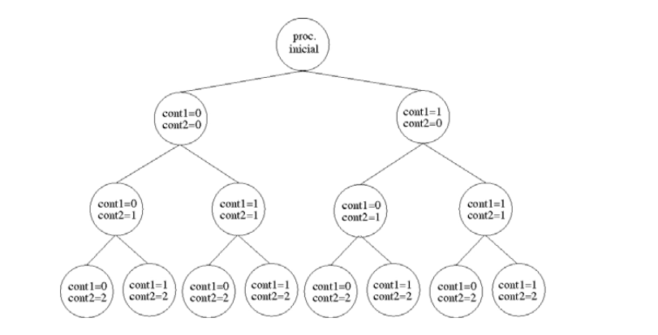
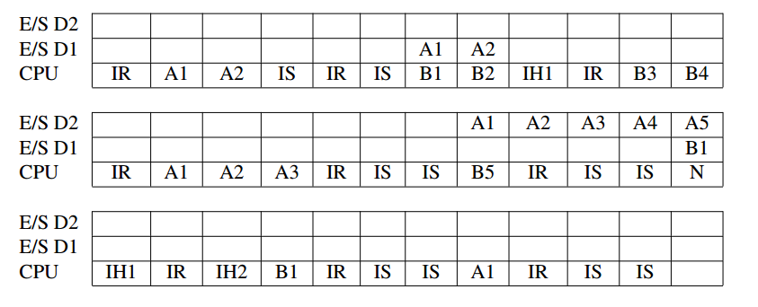

## Solución a la Prueba de Entrada del curso CC-571A

### Respuesta 1

El árbol de procesos se muestra a continuación donde para cada uno se indica la iteración en la que
se crea.




Escribamos el código fuente que implica el uso de las funciones mencionadas en el problema:

```c
#include <sys/types.h>
#include <sys/wait.h>
#include <unistd.h>
#include <stdio.h>
#include <stdlib.h>

#define L1 2
#define L2 3

 int main (int argc, char *argv[]) {
 int cont1, cont2;
 pid_t pid;
 for (cont2= 0; cont2< L2; cont2++) {
    for (cont1= 0; cont1< L1; cont1++) {
        pid= fork();
        if (pid== 0) break;
        }
    if (pid!= 0) break;
    }
    printf ("Soy el proceso de PID %d y mi proceso padre tiene %d de PID.\n",
    getpid(), getppid());
    if (pid!= 0)
        for (cont1= 0; cont1< L1; cont1++)
            printf ("Fin del proceso de PID  %d.\n", wait (NULL));
    return 0;
}
```

   

### Respuesta 2

Simplificamos el resultado con una tabla después de analizar el algoritmo de planificacion Round-Robin y las condiciones dadas por el problema.



### Respuesta 3

Si el tamaño de página son 2KB, esto implica que de los 22 bits de la dirección lógica, 11 bits se utilizan para direccionar la página, por lo que quedan 11 bits para codificar la tabla de páginas. 

Si se utiliza una tabla de páginas de un sólo nivel, su tamaño es el número de entradas de la tabla por el tamaño de la entrada, es decir, $2^{11}. 8 = 2^{14}$ bytes.

Con una tabla de páginas de dos niveles, 6 bits de la dirección lógica  se emplean para el primer nivel ya que el problema dice que 5 bits son para el segundo nivel. Entonces, cada tabla de segundo nivel direcciona hasta 25 páginas, es decir 32 páginas de 2KB cada una  de un total de 64KB. Como el proceso  requiere 90KB, hacen falta 2 tablas de segundo nivel. 

Así, el consumo es el de una tabla de primer nivel más el de dos de segundo nivel, esto es, $2^{6}.8 +2.2^{5}.8 = 2^{10}$ bytes.

Por lo tanto, al utilizar una tabla de páginas de dos niveles podemos tener un ahorro de bytes de $2^{14} -2^{10}$ o que es lo mismo 15360 bytes.

### Respuesta 4

El problema que surge ( a parte de que se debe corregir a *STDIN_FILENO* en el código) se debe a que no se cierra el descriptor de archivo y el proceso inicial tiene acceso al pipeline. Este escenario produce  que el proceso que cambia su imagen al comando *wc* , que lee del pipeline pasa bloqueado al vaciarla, aún cuando haya terminado el que cambia su imagen al comando *ls* que es lo que realmente escribe el pipeline.

Una solución al problema, con la condición de que el proceso inicial no va a utilizar el pipeline es mover la orden *pipe* justo después del primer *if* manteniendo así el acceso a los otros dos procesos pero evitando que el proceso inicial tenga al pipeline.

```c
#include <sys/types.h>
#include <sys/wait.h>
#include <unistd.h>
#include <stdio.h>
#include <stdlib.h> 

int main(int argc, char *argv[]) {
 int tubo[2];
 
 if (fork()==0) {
    pipe(tubo); // cambiar aquí
   if (fork()== 0) {
   dup2 (tubo[1], STDOUT_FILENO);
   close(tubo[0]);
   close(tubo[1]);
    execlp("ls", "ls", NULL);
  } else {
    dup2 (tubo[0], STDIN_FILENO);
    close(tubo[0]);
    close(tubo[1]);
    execlp("wc", "wc", "-l", NULL);
   }
 }else {
   wait(NULL);
   printf ("Fin del proceso\n");
   }
}
```

