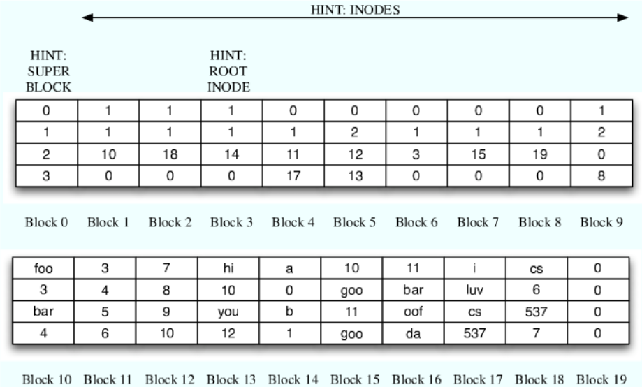
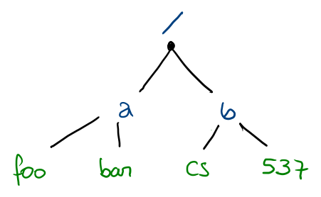
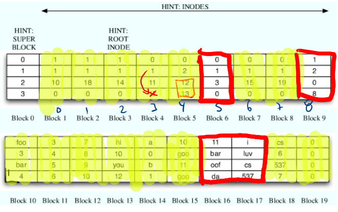

# Examen Final - solucionario no oficial - parte 2

## Respuesta 1

Tenemos

```
virtualdir:
+-+-+-+-+-+-+-+-+-+-+-+-+-+-+-+-+-+-+-+-+-+-+-+-+-+-+-+-+-+-+-+-+
|                  VPN                  |        offset         |
+-+-+-+-+-+-+-+-+-+-+-+-+-+-+-+-+-+-+-+-+-+-+-+-+-+-+-+-+-+-+-+-+
0                                      20                       31


TLB:
 VPN    PPN    PID
00000  00FFF   00
00000  00AAB   01
00010  F000A   00
010FF  00ABC   01

```


1. PID 00 genera la dirección virtual: `00000000 = 00000 000 -> 00FFF 000` ACIERTO!

2. PID 01 genera la dirección virtual: `00000000 = 00000 000 -> 00AAB 000` ACIERTO!

3. PID 00 genera la dirección virtual: `FF00FFAA = FF00F FAA -> fault!` FALLA!

4. PID 00 genera la dirección virtual: `0010FFAA = 0010F FAA -> fault!` FALLA!

5. PID 01 genera la dirección virtual: `0010FFAA = 0010F FAA -> fault!` FALLA!

6. PID 00 genera la dirección virtual: `000000FF = 00000 0FF -> 00FFF 0FF` ACIERTO!

7. PID 01 genera la dirección virtual: `00000FAB = 00000 FAB -> 00AAB FAB` ACIERTO!

8. PID 00 genera la dirección virtual: `010FFFFF = 010FF FFF -> fault` FALLA!

9. PID 01 genera la dirección virtual binaria 

    ```
    00000001000011111111010100001111 -> 0000 0001 0000 1111 1111 0101 0000 1111
    010FF 50F -> 00ABC 50F
    ```
ACIERTO!

10. PID 00 genera la dirección virtual binaria 

    

    ```
    00000001000011111111010100001111 -> 0000 0001 0000 1111 1111 0101 0000 1111
    010FF 50F -> faut!
    ```

    FALLA!!!

11. PID 02 genera la dirección virtual: `00000000` FALLA!! No hay, no existe!


## Respuesta 2

Veamos...

```python
class Barrier() :
    def __init__(self) :
        self.numofthreads = 0
        self.threadsatbarrier = 0
        self.mymutex
        self.mybarrier

    
    def threadCreated(self) :
        self.mymutex.acquire()
        self.numofthreads += 1
        self.mymutex.release()

    
    def threadEnd(self) :
        self.mymutex.acquire()
        self.numofthreads -= 1
        
        if self.threadsatbarrier == self.numofthreads :
            self.mybarrier.signal()
            self.threadsatbarrier = 0
        else :
            self.mybarrier.wait()

        self.mymutex.release()


    def BarrierReached(self) :
        self.mymutex.acquire()
        self.threadsatbarrier += 1
        
        if self.threadsatbarrier == self.numofthreads :
            self.mybarrier.signal()
            self.threadasatbarrier = 0
        else :
            self.mybarrier.wait()
        
        self.mymutex.release()
```

+ Se utilizó una condicional `if` porque fue lo primero que se me ocurrió.


## Respuesta 3

Se tiene el siguiente código:

```c
void vector_add(vector *v1, vector *v2) {
   mutex_lock(v1->lock); // aquí...
   mutex_lock(v2->lock); // aquí también...
   
   for (i = 0; i < v1->size; i++) {
      v1[i] = v1[i] + v2[i];
   }
   
   mutex_unlock(v1->lock);
   mutex_unlock(v2->lock);
}
```

Se ejecuta: 

```c
//Thread 1:
vector_add(&vectorA, &vectorB); // vale...
//Thread 2:
vector_add(&vectorB, &vectorA); // Diferente orden...
```

Esto está hecho de tal forma que el hilo 1 podría bloquear el vectorA al mismo tiempo que el hilo 2 bloquea el vectorB. Así, ninguno de los hilos podrá continuar su ejecución. Lo que se debe hacer es utilizar una variable mutex para el par de vectores, aunque esto podría ocasionar problemas al momento de trabajar con más de dos vectores y corremos el riesgo de tener un _cuello de botella_. Otra opción sería elegir un orden para los vectores antes de realizar el _lock_. De esta manera, siempre un vector tendrá que ser analizado primero.R

```c
typedef struct __cond_t {
    sem_t s;
} cond_t;

void cond_init(cond_t *c) {
    sem_init(&c->s, 0);
}

void cond_wait(cond_t *c, mutex_t *m) {
    mutex_unlock(&m);
    sem_wait(&c->s);
    mutex_lock(&m);
}

void cond_signal(cond_t *c) {
    sem_post(&c->s);
}
```

Recuerde que  `sem_wait()` es peligroso. Es mejor `sem_trywait()`.

## Respuesta 4

Para un disco con las siguientes características:

+ Número de cilindros: 512
+ Cilindro actual: 110
+ Cilindro anterior: 105

tenemos las siguientes consultas: `84, 302, 103, 96, 407, 113`

Para cada enfoque, mostraremos el cambio de estado del cabezal.

### SSTF
```
Cabezal: 110 -> 113 -> 103 -> 96 -> 84 -> 302 -> 407
             3     10     7     12    218    105
```
La distancia recorrida por el cabezal será 355 y llega hasta el cilindro 407

### FIFO
```
Cabezal: 110 -> 84 -> 302 -> 103 -> 96 -> 407 -> 113
             26    218   199     7    311     294
```
La distancia recorrida por el cabezal será 1055 y llega hasta el cilindro 113

### SCAN
```
Cabezal: 110 -> 113 -> 302 -> 407 -> 512 -> 103 -> 96 -> 84
             3     189    105    304     7     12
```
La distancia recorrida por el cabezal es 620 y llega hasta cilindro 84

### CSAN
```
Cabezal: 110 -> 113 -> 302 -> 407 -> 84 -> 96 -> 103
             3     189    105    323    12    7
```
La distancia recorrida por el cabezal es 639 y llega hasta el cilindro 103

### Óptimo
```
Cabezal: 110 -> 84 -> 96 -> 103 -> 113 -> 302 -> 407
             26    12    7      10    189    105
```
La distancia recorrida por el cabezal es 349 y llega hasta el cilindro 407

## Respuesta 5

En un sistema de ficheros que tiene las siguientes características

```
i-node format:
    type:           0 means regular file, 1 means directory
    size:           number of blocks in file (can be 0, 1, or 2)
    direct pointer: pointer to first block of file (if there is one)
    direct pointer: pointer to second block of file (if there is one)
directory format:
    name of file
    inode number of file
    name of next file
    inode number of next file
```

tenemos



+ Para leer el directorio _root_, miramos al bloque 3, donde nos dice que necesitamos leer el bloque 14.

+ Ahí vemos que hay un directorio `a`, y uno `b`.

+ Ahora mostramos hasta dónde podemos llegar desde _root_. Lo que está escrito en púrpura son directorios y lo que está escrito en verde son ficheros regurlares.

  

+ Los directorios accesibles son _root_ `a` y `b`.

+ El archivo más grande es el fichero en el inodo 4. Este es llamado `/a/bar`.

+ _Los contenidos_ de este archivo son:

  ```
  78910hi10you12
  ```

+ Después de un aburrido análisis...

  

la conclusión es que los inodos 5 y 8 (bloques 6 y 9, respectivamente) se encuentran libres. Además, los bloques 16 y 17 también se encuentran libres.