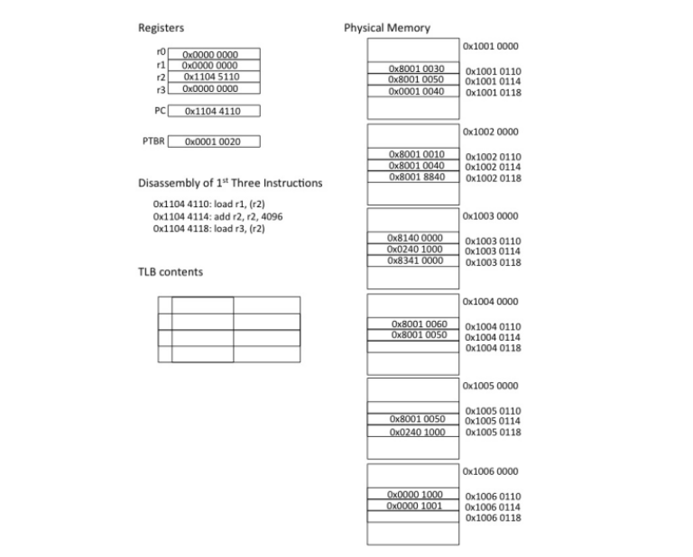
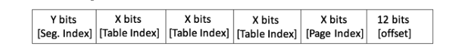
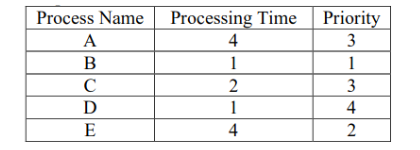
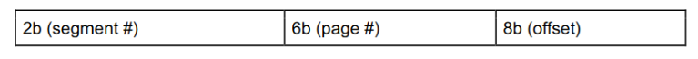
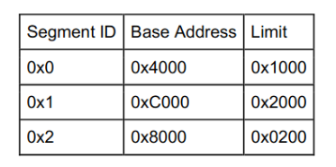
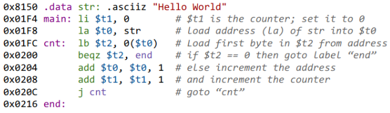

# Examen parcial - Solucionario no oficial

Resolución del examen parcial del curso de sistemas operativos avanzados.

## Pregunta 1

Agregar un TLB siempre mejorará la latencia de acceso a la memoria. Explica tu respuesta.

### Respuesta

No. Recuerde que, si una página no está en TLB, esta deberá buscarse en las páginas cargadas en RAM y, si no están allí, deberán buscarse en disco. Por otra parte, recuerde que **una RAM no siempre es una RAM** (ley de Culler).

## Pregunta 2

¿Una jerarquı́a de tablas de páginas multinivel siempre ocupará menos espacio de almacenamiento que una tabla de páginas de un solo nivel, dado el mismo tamaño de espacio de direcciones virtuales?. Explica tu respuesta.

### Respuesta

No, en general. Recuerde que necesita más espacio para almacenar el _page directory_. Puede que el desempeño mejore por el hecho de no almacenar entradas de páginas inválidas, pero también puede que no haya muchas entradas de páginas inválidas.

## Pregunta 3

La siguiente figura muestra el estado relevante de una máquina con espacio de direcciones virtuales de 32 bits compatible con una tabla de páginas de dos niveles con páginas de 4KB. Los contenidos de varios de los marcos de la memoria fı́sica se muestran a la derecha con direcciones fı́sicas. A la izquierda hay varios registros de la máquina, incluida la PC y el registro base de la tabla de páginas, que contiene el número de marcos fı́sico de la tabla de la página raı́z. Un TLB de 4 entradas, totalmente asociativo, está inicialmente vacı́o.



Las entradas de la tabla de páginas tienen el indicador válido como el bit más significativo y el número de marco fı́sico de las entradas válidas en los bits de orden inferior. Se puede suponer que otros indicadores son cero para este problema. Debes seguir las tres instrucciones cuya dirección y desamblaje se muestran en la figura.

+ Describe qué bits de la dirección virtual de 32 bits se utilizan para cada parte de la traducción de la dirección virtual. Para la dirección de la primera instrucción, 0x11044110, muestra el valor de cada uno de estos campos de bits. Para cada uno de los accesos a la tabla de páginas, ¿cuál es el offset de bytes de la entrada de la tabla de páginas a la que se accede?
+ En el espacio provisto a continuación, debes anotar la operación, la dirección y el valor asociados con cada operación de memoria asociada con las tres instrucciones. (Notarás que las entradas de la tabla de páginas están alineadas con palabras, objetos de 32 bits, por lo tanto, el  offset de bytes es 4 veces el ı́ndice (index)). Además, actualiza el estado de la memoria, registros y TLB sobrescribiendo en la figura. Identifica las excepciones que se generan (pero no te preocupes por manejarlas).

### Respuesta

tldr;

## Pregunta 4

Supongamos que tienes un sistema con punteros de 32 bits y 4 megabytes de memoria fı́sica que se divide en páginas de 8192 bytes. El sistema utiliza una tabla de páginas invertidas (IPT). Si se supone que no hay intercambio de páginas entre procesos.

+ Describe cómo deberı́an verse las entradas de la tabla de páginas. Especı́ficamente, ¿cuántos bits deben estar en cada entrada de la tabla de páginas y para qué sirven? Además, ¿cuántas entradas de la tabla de páginas deberı́a haber en la tabla de páginas?

Como `2**13 = 8192`, necesitamos 13bits para el offset. Tendríamos.

```
+-+-+-+-+-+-+-+-+-+-+-+-+-+-+-+-+-+-+-+-+-+-+-+-+-+-+-+-+-+-+-+-+-+
|              VPN u otros            |          offset           |
+-+-+-+-+-+-+-+-+-+-+-+-+-+-+-+-+-+-+-+-+-+-+-+-+-+-+-+-+-+-+-+-+-+
 0 1 2 3              ...             18             ...         31
```

Tendremos `4*1024*1024 / 8192 = 512` entradas de páginas. 

+ Describe cómo se usa un IPT para traducir una dirección virtual en una dirección fı́sica

No hay necesidad de traductir una dirección virtual a una dirección física. Por el contrario, según la definición de Remzi, un enfoque IPT implica una sola tabla de páginas con una entrada por cada **página física** y esta nos indica qué proceso está usandola y a qué página virtual está asociada. Es decir, se traduce de página física a página virtual.

+ ¿Cómo se puede hacer que un IPT sea más eficiente? Explica tu solución y cómo funciona en detalle.

Ni idea. Poniendo caché, como siempre, tal vez.

+ ¿Qué efecto, en tu caso, tiene tu solución en la parte anterior sobre lo que sucede en un cambio de contexto?

  Las mismas deficiencias que todo TLB.


## Pregunta 5

Supongamos que hemos dividido nuestro espacio de direcciones virtuales de 64 bits de la siguiente manera:



Podremos almacenar `2**x` entradas de página. 

Entonces, `4*x + y + 12 = 64` . Luego `4*x + y = 52`.

Creo que supondré que solo hay los tres segmentos básicos: unused, stack, heap, code.

+ ¿Qué tan grande es una página en este sistema?

  Tendremos `2**12 = 4096` bytes por cada página.

+ Si suponemos que las tablas de páginas están divididas en partes de tamaño de una página (para que puedan ser paginadas en el disco). ¿Cuántos PTE caben en una tabla de páginas?. ¿Cuál es el valor de X?

  Si tomamos el enfoque de tres segmentos, entonces tendremos `4*x = 50`... llegamos a un absurdo. Seguro de que no falta algún dato?

+ ¿Cuál es el tamaño del ı́ndice de segmento (Y)?  ¿Cuántos segmentos puede tener el sistema?

  El sistema puede tener `2**2 = 4` 

+ ¿Cuál serı́a el formato de un PTE (entrada de tabla de página)?. Muestra el formato de incluir bits necesarios para admitir el algoritmo de reloj para el reemplazo de páginas y optimizaciones de copia en escritura, es decir, un bit sucio, un bit válido y un bit usado. (Se supone: un espacio de direcciones fı́sicas de 64 bits)

+ Si el segmento heap de un usuario está completamente lleno, ¿cuánto espacio ocupan las tablas de páginas para este segmento?.


## Pregunta 6

Considera el siguiente conjunto de procesos, con tiempos y prioridades de procesamiento asociados.




Para cada algoritmo de planificación, completa la tabla con el proceso que se ejecuta en la CPU (para algoritmos basados en segmentos de tiempo, suponga un segmento de tiempo de 1 unidad).

Notas:

+ Un número de prioridad más pequeño implica una prioridad más alta.
+ Para RR y Priority, supongamos que se ejecuta un hilo de llegada al comienzo de su hora de llegada, si la polı́tica de planificación lo permite.
+ Todos los procesos llegan al tiempo 0 en el orden Process A, B, C, D, E.
+ Supongamos que el hilo que se está ejecutando actualmente no está en la cola ready mientras se está ejecutando.
+ El TAT (turnaround time ) se define como el tiempo que tarda un proceso en completarse una vez que llega.


Para el caso de FIFO, usamos el programa `planificador.py`

```
gwynplaine@tabernacle:~/ofuscateddir$ python3 planificador.py -l 4,1,2,1,4 -c
Arguments policy FIFO
Arguments jlist 4,1,2,1,4

Here is the job list, with the run time of each job: 
Job 0 (length = 4.0 )
Job 1 (length = 1.0 )
Job 2 (length = 2.0 )
Job 3 (length = 1.0 )
Job 4 (length = 4.0 )


Solutions

Execution trace:
[Time  0 ] Run job 0 for 4.00 secs ( DONE at 4.00 )
[Time  4 ] Run job 1 for 1.00 secs ( DONE at 5.00 )
[Time  5 ] Run job 2 for 2.00 secs ( DONE at 7.00 )
[Time  7 ] Run job 3 for 1.00 secs ( DONE at 8.00 )
[Time  8 ] Run job 4 for 4.00 secs ( DONE at 12.00 )

Final statistics:
Job   0 -- Response: 0.00  Turnaround 4.00  Wait 0.00
Job   1 -- Response: 4.00  Turnaround 5.00  Wait 4.00
Job   2 -- Response: 5.00  Turnaround 7.00  Wait 5.00
Job   3 -- Response: 7.00  Turnaround 8.00  Wait 7.00
Job   4 -- Response: 8.00  Turnaround 12.00  Wait 8.00

  Average -- Response: 4.80  Turnaround 7.20  Wait 4.80

```

Para RR, también:

```
gwynplaine@tabernacle:~/ofuscateddir$ python3 planificador.py -l 4,1,2,1,4 -p RR -q 1 -c
Arguments policy RR
Arguments jlist 4,1,2,1,4

Here is the job list, with the run time of each job: 
Job 0 (length = 4.0 )
Job 1 (length = 1.0 )
Job 2 (length = 2.0 )
Job 3 (length = 1.0 )
Job 4 (length = 4.0 )


Solutions

Execution trace:
[Time   0 ] Run job   0 for 1.00 secs
[Time   1 ] Run job   1 for 1.00 secs ( DONE at 2.00 )
[Time   2 ] Run job   2 for 1.00 secs
[Time   3 ] Run job   3 for 1.00 secs ( DONE at 4.00 )
[Time   4 ] Run job   4 for 1.00 secs
[Time   5 ] Run job   0 for 1.00 secs
[Time   6 ] Run job   2 for 1.00 secs ( DONE at 7.00 )
[Time   7 ] Run job   4 for 1.00 secs
[Time   8 ] Run job   0 for 1.00 secs
[Time   9 ] Run job   4 for 1.00 secs
[Time  10 ] Run job   0 for 1.00 secs ( DONE at 11.00 )
[Time  11 ] Run job   4 for 1.00 secs ( DONE at 12.00 )

Final statistics:
Job   0 -- Response: 0.00  Turnaround 11.00  Wait 7.00
Job   1 -- Response: 1.00  Turnaround 2.00  Wait 1.00
Job   2 -- Response: 2.00  Turnaround 7.00  Wait 5.00
Job   3 -- Response: 3.00  Turnaround 4.00  Wait 3.00
Job   4 -- Response: 4.00  Turnaround 12.00  Wait 8.00

 Average -- Response: 2.00  Turnaround 7.20  Wait 4.80

```


Para SRTF


Para Priority, usamos el código encontrado [aquí](https://www.studytonight.com/operating-system/priority-scheduling). También hay una copia del fichero `priority.c` anexada.

Dada la forma en que está implementada la prioridad en el código, usaremos la siguiente equivalencia:

```
1 2 3 4
| | | |
4 2 3 1
```

Así, procedemos

```
gwynplaine@tabernacle:~/ofuscateddirl$ g++ -o priority priority.c 
gwynplaine@tabernacle:~/offuscateddir$ ./priority 
Order in which processes gets executed 
2 5 1 3 4 
Processes   Burst time   Waiting time   Turn around time
   2		1	    0		  1
   5		4	    1		  5
   1		4	    5		  9
   3		2	    9		  11
   4		1	    11		  12

Average waiting time = 5.2
Average turn around time = 7.6
```

## Pregunta 7

Considere un sistema con solo direcciones virtuales, pero sin concepto de memoria virtual o demanda de páginas. Se define el tiempo total de acceso a la memoria como el tiempo para acceder al código/datos desde una dirección en la memoria fı́sica, incluido el tiempo para resolver la dirección (a través del TLB o tablas de páginas) y el acceso a la memoria fı́sica en sı́. Cuando el TLB resuelve una dirección virtual, los experimentos en una máquina han observado empı́ricamente que el tiempo total de acceso a la memoria es (un valor aproximadamente constante de) $t_h$. De manera similar, cuando la dirección virtual no está en el TLB, se observa que el tiempo total de acceso a la memoria es $t_m$ . Si se observa además que el tiempo total promedio de acceso a la memoria del sistema (promediado en todos los accesos a la memoria, incluidos los aciertos (hit) y errores (misses) de TLB) es $t_x$ , calcula qué fracción de direcciones de memoria resuelve el TLB. En otras palabras, encuentra una expresión para la tasa de aciertos del TLB en términos de $t_h, t_m$ y $t_x$. Puedes suponer que $ t_m > t_h $


## Pregunta 8

Escribe un programa, llamado tlb.c, que puede medir aproximadamente el costo de acceder a cada página. Las entradas al programa deben ser: el número de páginas a tocar y el número de pruebas. Ahora escribe un script para ejecutar este programa, mientras varı́a el número de páginas a las que se accede desde 1 hasta unos pocos miles, quizás incrementándose en un factor de dos por iteración. ¿Cuántas pruebas son necesarias para obtener mediciones confiables?. Grafica los resultados.

## Pregunta 9

Considere una computadora con 16 direcciones virtuales y fı́sicas. La traducción de direcciones se implementa mediante un esquema de dos niveles que combina segmentación y paginación. El tamaño de la página es de 256 bytes.
Formato de dirección virtual:



Tabla de segmentos (Base Adress especifica la dirección de la tabla de páginas asociada con el segmento y Limit especifica el número total de bytes en el segmento):



De esto:

```
0x4000 => [0x20, 0x30, 0x31]
0xC000 => [0x40, 0x44]
0x8000 => [0xC0, 0xC1]
```


+ ¿Cuál es la dirección fı́sica correspondiente a la dirección virtual 0x4125?

  `0x4125 = 01 000001 00100101` o que simboliza: segmento 1, página 1, offset 0x25. El segmento 1 traduce a 0xC000, la página 1 de ese segmento es 0x44. Así, nuestra dirección sería 0x4425.

+ Considera el siguiente código ensamblador que calcula la longitud de una cadena:

  

  |        inst        | phys addr |  $t0   | $t1  | $t2  |
  | :----------------: | :-------: | :----: | :--: | :--: |
  |    `li $t1, 0`     |  0x30F4   |   -    |  0   |  -   |
  |   `la $t0, str`    |  0x30F8   | 0x8150 |  0   |  -   |
  | `lb $t2, 0($t0)` * |  0x30FC   | 0x8150 |  0   | 0x48 |
  |  `beqz $t2, end`   |  0x3100   | 0x8150 |  0   | 0x48 |
  | `add $t0, $t0, 1`  |  0x3104   | 0x8151 |  0   | 0x48 |
  | `add $t1, $t1, 1`  |  0x3108   | 0x8151 |  1   | 0x48 |
  |      `j cnt`       |  0x310C   | 0x8151 |  1   | 0x48 |
  
  Luego, se repetirá en bucle, desde *, hasta recorrer todo `str` y lo que variará será el valor de $t2 que irá recorriendo el valor ascii de e, l, o y así.
  
+ Suponga que en lugar de Hello World tenemos una cadena de 200 bytes. ¿Hay algún cambio que necesitemos hacer al segmento o a la tabla de páginas para admitir la cadena de 200 bytes?. En caso afirmativo, describe el cambio (el código no cambia y las direcciones para cada instrucción y datos permanecen iguales).

  Razone que la dirección 0x8150 es virtual. El offset 0x50 es 80 en decimal. Esto quiere decir que el final de nuestra cadena de 200 bytes estaría en el offset 280. ¡Overflow, solo podemos usar 256! Necesitamos una página más para alojar nuestra cadena.

## Pregunta 10

Responder las siguientes preguntas:

+ ¿Qué es una tabla de páginas invertidas?. ¿Cuáles son las relaciones entre el tamaño de la tabla de páginas invertidas, el tamaño del espacio de direcciones virtuales y el tamaño del espacio de direcciones fı́sicas?

  Según OSTEP,  es una sola tabla de páginas con una entrada por cada **página física**, donde cada entrada nos indica qué proceso está usandola y a qué página virtual está asociada. Es decir, se traduce de página física a página virtual.

+ Demuestra que SJF es optimal (tiempo promedio mı́nimo de finalización, promediado sobre todos los trabajos) en un sistema que comienza con exactamente N trabajos, cada uno de cuyos tiempos de ejecución son conocidos, y al que no llegan más trabajos.

+ Asume un sistema con segmentación pero sin paginación. Supongamos que el sistema usa una tabla de segmentos. Muestra cómo se usa una dirección virtual para hacer una referencia de memoria. (Debes asegurarte de mostrar todos los campos de entrada de la tabla de segmentos y sus usos, los registros necesarios, etc.)

