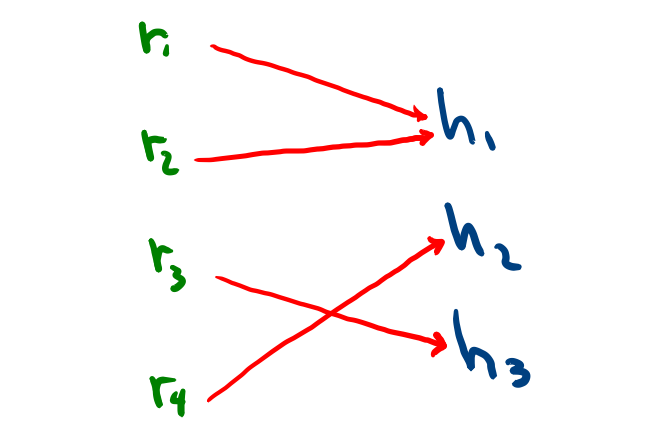

# Tarea de codificación 3


## Pregunta 1

TL;DR

## Pregunta 2 
+ No es posible que exista un deadlock por el principio del palomar.
  Sea $T$ nuestro conjunto de hilos. Está claro que $|T| = 3$. Ahora bien, cada hilo necesita 2 recursos de nuestro conjunto de recursos $R$, donde $|R|= 4$,  para poder ejecutarse y además cada recurso puede ser ocupado por un proceso a la vez.  Sea 
  $$
  \begin{align*}
  \varphi_t : R \rightarrow T \\
  r\mapsto h
  \end{align*}
  $$
  una función que mapea el recurso $r$ con el hilo $h$ por el que está siendo usado en un tiempo $t$. Por el principio del palomar, para todo $t$, esta función no será inyectiva. Así, siempre habrá dos recursos asignados a un solo hilo y siempre habrá un hilo que pueda ejecutarse.

  Hice un dibujito para ilustrarlo mejor:

  

+ Voy a justificar su **no elección**: No se puede conocer de antemano los recursos utilizados por los usuarios.

## Pregunta 3

TL;DR

## Pregunta 4

Una forma sencilla de implementarlo sería usando un paradigma orientada a objetos:

```python
from asyncio import Semaphore
import sys

err = sys.stderr.write

class monitor:
	def __init__(sinit, smax) :
        self.true_sem_up = Semaphore()
    	self.true_sem_down = Semaphore()
	
        if sini > smax :
           	err('invalid!')
         	exit(1) 
        self.semaphore = sinit # contador
        self.SMAX = smax

	
	def up() :
		while semaphoro >= SMAX :
			self.true_sem_up.acquire() # do nothing
	
		self.semaphore = self.semaphore + 1
        self.true_sem_up.release()

        
	def down() :
		while semaphoro <= 0 :
			self.true_sem_down.acquire() # do nothing
		
		self.semaphore = self.semaphore - 1
        self.true_sem_down.release()
```


## Pregunta 5

+ Restricciones
  + Debe haber al menos 3 hilos, siendo 2 de hidrógeno y 1 de oxígeno. Es decir, cada hilo llama a una función: `hReady` o `oReady`
  + Solo es necesario que el hilo de oxígeno llame a `makeWater`.
+ Pseudocódigo utilizando el pseudocódigo del problema anterior:

```python
from asyncio import Semaphore
sem_h = Semaphore(0)
sem_o = Semaphore(0)
h_count = 0

def makeWater() :
    print('This problem sucks!')

def hReady() :
    h_count = (h_count + 1) % 2
    
    if h_count == 0 :
        sem_h.part()
    
    sem_o.acquire()


def oReady() :
    h_sem.acquire()
    makeWater()
    sem_o.part()
```


## Pregunta 6

Asumiremos que `hacer_algo()` y `salir()` nos toman `T_1` y `T_2` respectivamente.

```
mutex_lock (); 	# A
hacer_algo(); 	# T_1
mutex_unlock();	# A
salir();		# T_2
```


+ El mejor tiempo ocurre cuando no hay un cambio de contexto durante la ejecución de el primer hilo que se apropia del recurso. Además, $T_1, T_2 < T$ Este es: $4A + 2T_1 + 2T_2 + C$

  | time  |    thread 1    |    thread 2    |
  | :---: | :------------: | :------------: |
  |  $A$  |  mutex_lock()  |       -        |
  | $T_1$ |  hacer_algo()  |       -        |
  |  $A$  | mutex_unlock() |       -        |
  | $T_2$ |    salir()     |       -        |
  |  $C$  |       -        |       -        |
  |  $A$  |       -        |  mutex_lock()  |
  | $T_1$ |       -        |  hacer_algo()  |
  |  $A$  |       -        | mutex_unlock() |
  | $T_2$ |       -        |    salir()     |

+ El peor tiempo ocurre cuando se da un cambio de contexto durante la ejecución de el primer hilo que se apropia del recurso. También se debería tener en cuenta que $T_1, T_2 > T$, pero como no sabemos cuanto más, prefiero escoger lo contrario y escoger el peor caso sobre esa premisa. El cambio de contexto puede ser antes o después de ejecutar `hacer_algo`. Esto es: $4A + 3C + T + 2T_1 + 2T_2$

| time  |    thread 1    |       thread 2        |
| :---: | :------------: | :-------------------: |
|  $A$  |  mutex_lock()  |           -           |
|  $C$  |       -        |           -           |
|  $T$  |       -        | mutex_lock() # Failed |
|  $C$  |       -        |           -           |
| $T_1$ |  hacer_algo()  |           -           |
|  $A$  | mutex_unlock() |           -           |
| $T_2$ |    salir()     |           -           |
|  $C$  |       -        |           -           |
|  $A$  |       -        |     mutex_lock()      |
| $T_1$ |       -        |     hacer_algo()      |
|  $A$  |       -        |    mutex_unlock()     |
| $T_2$ |       -        |        salir()        |


## Pregunta 7

El algoritmo de Peterson, para un proceso i, es el siguiente:

```C
// snipet from https://en.wikipedia.org/wiki/Peterson%27s_algorithm
// shared variables
bool flag[2] = {false, false};
int turn;
// end of shared variables

P0:      flag[0] = true;
P0_gate: turn = 1;
         while (flag[1] == true && turn == 1)
         {
             // busy wait
         }
         // critical section
         ...
         // end of critical section
         flag[0] = false;
```

El algoritmo presentado es:

```c
Proceso Pi:
do {
    indicador[i] = TRUE;
    turno = i;
    while (indicador[j] && indicador == j);
    <seccion critica>
    indicador[i] = FALSE;
    <seccion restante>
} while (TRUE);
```

Vemos que la variable `ìndicador[]` es una variable compartida de tipo `int *`, y vemos que gcc se enojará cuando al leer que después del `&&` se comparan un tipo`int *` con un tipo `int`. Para corregirlo, habría que cambiar `indicador` por `turno`. 

## Pregunta 8

```python
from pregunta4 import monitor

sillas = 0
mon = monitor(0, N)

def dentista :
    while True :
        mon.down()
        sillas = sillas - 1

def paciente() :
    if sillas == N : return
    
    mon.up()
    sillas = sillas + 1
    
```


## Pregunta 9

VS;SDR

## Pregunta 10

Código `server.c`.

